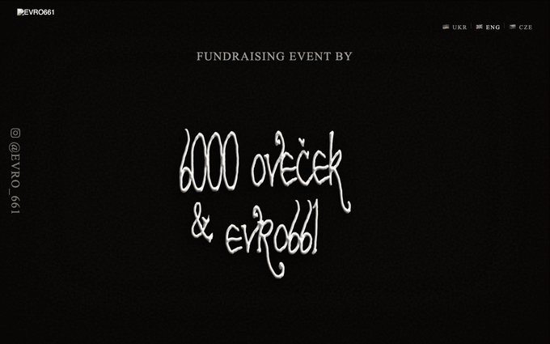

# 6000ovecek × EVRO661

**Charity event site · May 8–9, 2026 · Strahov Stadium, Prague** 
two days of underground music, experimental audio and visual art · all proceeds fund FPV drones for Ukraine

[**evro661.vercel.app**](https://evro661.vercel.app)

 

 

## About

The site for a two-day charity event organized by **6000ovecek** and **EVRO661** at Strahov Stadium in Prague. You enter through a pair of barn doors: they swing open, the camera dives into the light, and you land inside with the lineup of 23 artists.

The look is DIY punk: torn paper strips, cut-out lettering, hard shadows and no rounded corners.

 

## What's inside

* **3D entrance.** Barn doors built in Three.js with bloom and film grain post-processing. Clicking Enter opens them and dives the camera through.
* **Lineup.** Each artist is a torn paper strip. Click one to see photos, a video and a bio: side panels on desktop, a bottom sheet on mobile.
* **Three languages.** UA / EN / CZ, including every artist bio. The site starts in the browser's language and remembers the choice.
* **Small extras.** A football mini-game on canvas, ambient sound toggle, venue map, links to tickets and the fundraiser.

 

## Stack

Single `index.html`, no build step: Three.js (EffectComposer, UnrealBloomPass), vanilla JS, SVG filters for torn edges. Deployed on Vercel.

 

## Links

* Tickets: [GoOut](https://goout.net/en/6k-and-evro661-spring-strahov4ukraine/sznyyiy/)
* Fundraiser: [Drony solidarity čtyři on Donio](https://donio.cz/drony-solidarity-ctyri)
* Instagram: [@evro_661](https://www.instagram.com/evro_661/) · [@sest_tisicu_ovecek](https://www.instagram.com/sest_tisicu_ovecek/)
